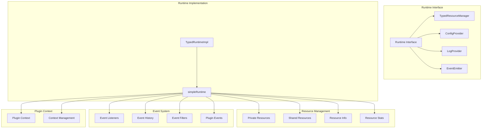
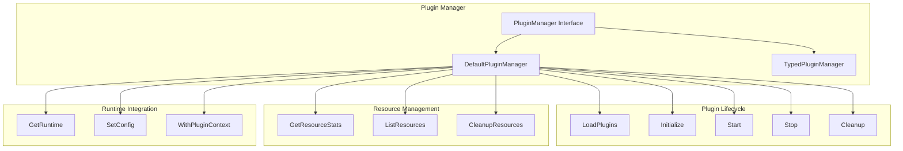
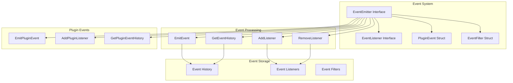
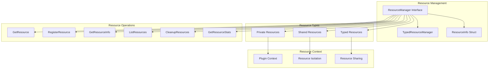

# Lynx Layered Runtime Architecture Design

## Architecture Overview

The Lynx framework adopts a layered Runtime design, providing unified resource management, event systems, and plugin lifecycle management. The entire architecture is divided into three main layers:

```
┌─────────────────────────────────────────────────────────────────┐
│                    Lynx Application Layer                      │
├─────────────────────────────────────────────────────────────────┤
│  ┌─────────────┐  ┌─────────────┐  ┌─────────────┐           │
│  │ LynxApp     │  │ Boot        │  │ Control     │           │
│  │             │  │             │  │ Plane       │           │
│  └─────────────┘  └─────────────┘  └─────────────┘           │
└─────────────────────────────────────────────────────────────────┘
                                │
                                ▼
┌─────────────────────────────────────────────────────────────────┐
│                  Plugin Management Layer                       │
├─────────────────────────────────────────────────────────────────┤
│  ┌─────────────┐  ┌─────────────┐  ┌─────────────┐           │
│  │ Plugin      │  │ TypedPlugin │  │ Plugin      │           │
│  │ Manager     │  │ Manager     │  │ Factory     │           │
│  └─────────────┘  └─────────────┘  └─────────────┘           │
└─────────────────────────────────────────────────────────────────┘
                                │
                                ▼
┌─────────────────────────────────────────────────────────────────┐
│                    Runtime Layer                               │
├─────────────────────────────────────────────────────────────────┤
│  ┌─────────────┐  ┌─────────────┐  ┌─────────────┐           │
│  │ Runtime     │  │ TypedRuntime│  │ Simple      │           │
│  │ Interface   │  │ Impl        │  │ Runtime     │           │
│  └─────────────┘  └─────────────┘  └─────────────┘           │
└─────────────────────────────────────────────────────────────────┘
                                │
                                ▼
┌─────────────────────────────────────────────────────────────────┐
│                Resource Management Layer                       │
├─────────────────────────────────────────────────────────────────┤
│  ┌─────────────┐  ┌─────────────┐  ┌─────────────┐           │
│  │ Private     │  │ Shared      │  │ Resource    │           │
│  │ Resources   │  │ Resources   │  │ Info        │           │
│  └─────────────┘  └─────────────┘  └─────────────┘           │
└─────────────────────────────────────────────────────────────────┘
```

## Detailed Architecture Diagram

### 1. Runtime Interface Hierarchy



### 2. Plugin Manager Architecture



### 3. Event System Architecture



### 4. Resource Management Architecture



## Core Component Details

### 1. Runtime Interface

```go
type Runtime interface {
    TypedResourceManager
    ConfigProvider
    LogProvider
    EventEmitter
    
    // Logically separated resource management
    GetPrivateResource(name string) (any, error)
    RegisterPrivateResource(name string, resource any) error
    GetSharedResource(name string) (any, error)
    RegisterSharedResource(name string, resource any) error
    
    // Improved event system
    EmitPluginEvent(pluginName string, eventType string, data map[string]any)
    AddPluginListener(pluginName string, listener EventListener, filter *EventFilter)
    GetPluginEventHistory(pluginName string, filter EventFilter) []PluginEvent
    
    // Plugin context management
    WithPluginContext(pluginName string) Runtime
    GetCurrentPluginContext() string
    
    // Configuration management
    SetConfig(conf config.Config)
}
```

### 2. simpleRuntime Implementation

```go
type simpleRuntime struct {
    // Private resources: each plugin manages independently
    privateResources map[string]map[string]any
    // Shared resources: shared by all plugins
    sharedResources map[string]any
    // Resource info: track resource lifecycle
    resourceInfo map[string]*ResourceInfo
    // Configuration
    config config.Config
    // Mutex
    mu sync.RWMutex
    
    // Event system
    listeners    map[string][]EventListener
    eventHistory []PluginEvent
    eventMu      sync.RWMutex
    maxHistory   int
    
    // Plugin context
    currentPluginContext string
    contextMu           sync.RWMutex
}
```

### 3. Resource Info Structure

```go
type ResourceInfo struct {
    Name        string
    Type        string
    PluginID    string
    IsPrivate   bool
    CreatedAt   time.Time
    LastUsedAt  time.Time
    AccessCount int64
    Size        int64 // Resource size (bytes)
    Metadata    map[string]any
}
```

## Design Advantages

### 1. Layered Design Advantages

- **Separation of Concerns**: Each layer focuses on specific functionality
- **Extensibility**: Easy to add new runtime implementations
- **Testability**: Each layer can be tested independently
- **Maintainability**: Clear hierarchical structure for easy maintenance

### 2. Resource Management Advantages

- **Logical Separation**: Private and shared resources are managed separately
- **Lifecycle Management**: Complete resource tracking and cleanup
- **Type Safety**: Generic support for type-safe resource access
- **Performance Monitoring**: Resource statistics and size estimation

### 3. Event System Advantages

- **Plugin Isolation**: Plugin namespace events avoid conflicts
- **Event Filtering**: Support for multiple filtering conditions
- **History Records**: Complete event history queries
- **Concurrency Safety**: Thread-safe event processing

### 4. Plugin Context Advantages

- **Resource Isolation**: Each plugin has independent resource context
- **Flexible Sharing**: Support for cross-plugin resource sharing
- **Hot Update Support**: Context isolation supports plugin hot updates
- **Debug Friendly**: Clear resource ownership relationships

## Usage Examples

### 1. Basic Usage

```go
// Create plugin manager
manager := app.NewPluginManager()

// Get runtime
runtime := manager.GetRuntime()

// Register shared resources
runtime.RegisterSharedResource("database", db)

// Create context for plugin
pluginRuntime := runtime.WithPluginContext("my-plugin")

// Register private resources
pluginRuntime.RegisterPrivateResource("config", config)
```

### 2. Event Handling

```go
// Add event listener
listener := &MyEventListener{}
runtime.AddListener(listener, nil)

// Add plugin-specific listener
runtime.AddPluginListener("my-plugin", listener, nil)

// Emit events
runtime.EmitPluginEvent("my-plugin", "started", map[string]any{
    "timestamp": time.Now().Unix(),
})
```

### 3. Resource Management

```go
// Get resource statistics
stats := manager.GetResourceStats()

// List all resources
resources := manager.ListResources()

// Clean up plugin resources
manager.CleanupResources("my-plugin")
```

## Summary

Lynx's layered Runtime design provides a powerful, flexible, and type-safe plugin system architecture. Through layered design, logically separated resource management, comprehensive event systems, and plugin context support, it provides a solid foundation for complex plugin systems.

This architecture is particularly suitable for:
- Plugin design in microservice architectures
- Systems requiring hot update capabilities
- Complex resource management scenarios
- Systems requiring strict type safety
- Systems requiring comprehensive monitoring and debugging capabilities
