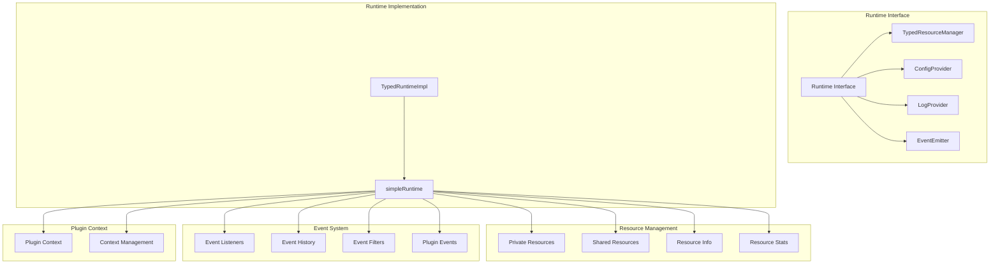
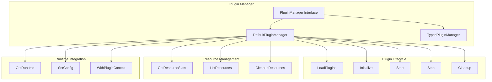
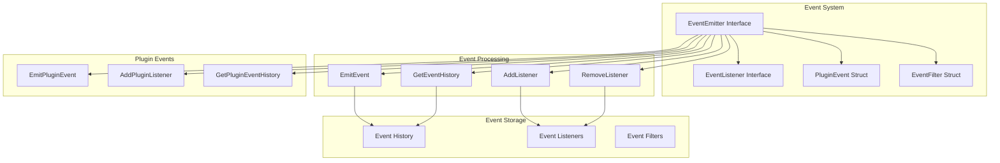
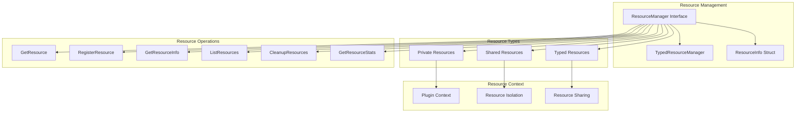

# Lynx 分层 Runtime 架构设计

## 架构概览

Lynx 框架采用分层 Runtime 设计，提供统一的资源管理、事件系统和插件生命周期管理。整个架构分为三个主要层次：

```
┌─────────────────────────────────────────────────────────────────┐
│                    Lynx 应用层 (Application Layer)              │
├─────────────────────────────────────────────────────────────────┤
│  ┌─────────────┐  ┌─────────────┐  ┌─────────────┐           │
│  │ LynxApp     │  │ Boot        │  │ Control     │           │
│  │             │  │             │  │ Plane       │           │
│  └─────────────┘  └─────────────┘  └─────────────┘           │
└─────────────────────────────────────────────────────────────────┘
                                │
                                ▼
┌─────────────────────────────────────────────────────────────────┐
│                  插件管理层 (Plugin Management Layer)            │
├─────────────────────────────────────────────────────────────────┤
│  ┌─────────────┐  ┌─────────────┐  ┌─────────────┐           │
│  │ Plugin      │  │ TypedPlugin │  │ Plugin      │           │
│  │ Manager     │  │ Manager     │  │ Factory     │           │
│  └─────────────┘  └─────────────┘  └─────────────┘           │
└─────────────────────────────────────────────────────────────────┘
                                │
                                ▼
┌─────────────────────────────────────────────────────────────────┐
│                  运行时层 (Runtime Layer)                       │
├─────────────────────────────────────────────────────────────────┤
│  ┌─────────────┐  ┌─────────────┐  ┌─────────────┐           │
│  │ Runtime     │  │ TypedRuntime│  │ Simple      │           │
│  │ Interface   │  │ Impl        │  │ Runtime     │           │
│  └─────────────┘  └─────────────┘  └─────────────┘           │
└─────────────────────────────────────────────────────────────────┘
                                │
                                ▼
┌─────────────────────────────────────────────────────────────────┐
│                  资源管理层 (Resource Management Layer)          │
├─────────────────────────────────────────────────────────────────┤
│  ┌─────────────┐  ┌─────────────┐  ┌─────────────┐           │
│  │ Private     │  │ Shared      │  │ Resource    │           │
│  │ Resources   │  │ Resources   │  │ Info        │           │
│  └─────────────┘  └─────────────┘  └─────────────┘           │
└─────────────────────────────────────────────────────────────────┘
```

## 详细架构图

### 1. Runtime 接口层次结构



### 2. 插件管理器架构



### 3. 事件系统架构



### 4. 资源管理架构



## 核心组件详解

### 1. Runtime 接口

```go
type Runtime interface {
    TypedResourceManager
    ConfigProvider
    LogProvider
    EventEmitter
    
    // 逻辑分离的资源管理
    GetPrivateResource(name string) (any, error)
    RegisterPrivateResource(name string, resource any) error
    GetSharedResource(name string) (any, error)
    RegisterSharedResource(name string, resource any) error
    
    // 改进的事件系统
    EmitPluginEvent(pluginName string, eventType string, data map[string]any)
    AddPluginListener(pluginName string, listener EventListener, filter *EventFilter)
    GetPluginEventHistory(pluginName string, filter EventFilter) []PluginEvent
    
    // 插件上下文管理
    WithPluginContext(pluginName string) Runtime
    GetCurrentPluginContext() string
    
    // 配置管理
    SetConfig(conf config.Config)
}
```

### 2. simpleRuntime 实现

```go
type simpleRuntime struct {
    // 私有资源：每个插件独立管理
    privateResources map[string]map[string]any
    // 共享资源：所有插件共享
    sharedResources map[string]any
    // 资源信息：跟踪资源生命周期
    resourceInfo map[string]*ResourceInfo
    // 配置
    config config.Config
    // 互斥锁
    mu sync.RWMutex
    
    // 事件系统
    listeners    map[string][]EventListener
    eventHistory []PluginEvent
    eventMu      sync.RWMutex
    maxHistory   int
    
    // 插件上下文
    currentPluginContext string
    contextMu           sync.RWMutex
}
```

### 3. 资源信息结构

```go
type ResourceInfo struct {
    Name        string
    Type        string
    PluginID    string
    IsPrivate   bool
    CreatedAt   time.Time
    LastUsedAt  time.Time
    AccessCount int64
    Size        int64 // 资源大小（字节）
    Metadata    map[string]any
}
```

## 设计优势

### 1. 分层设计优势

- **关注点分离**：每层专注于特定功能
- **可扩展性**：易于添加新的运行时实现
- **可测试性**：各层可以独立测试
- **可维护性**：清晰的层次结构便于维护

### 2. 资源管理优势

- **逻辑分离**：私有资源和共享资源分离管理
- **生命周期管理**：完整的资源跟踪和清理
- **类型安全**：泛型支持类型安全的资源访问
- **性能监控**：资源统计和大小估算

### 3. 事件系统优势

- **插件隔离**：插件命名空间事件避免冲突
- **事件过滤**：支持多种过滤条件
- **历史记录**：完整的事件历史查询
- **并发安全**：线程安全的事件处理

### 4. 插件上下文优势

- **资源隔离**：每个插件有独立的资源上下文
- **灵活共享**：支持跨插件的资源共享
- **热更新支持**：上下文隔离支持插件热更新
- **调试友好**：清晰的资源归属关系

## 使用示例

### 1. 基本使用

```go
// 创建插件管理器
manager := app.NewPluginManager()

// 获取运行时
runtime := manager.GetRuntime()

// 注册共享资源
runtime.RegisterSharedResource("database", db)

// 为插件创建上下文
pluginRuntime := runtime.WithPluginContext("my-plugin")

// 注册私有资源
pluginRuntime.RegisterPrivateResource("config", config)
```

### 2. 事件处理

```go
// 添加事件监听器
listener := &MyEventListener{}
runtime.AddListener(listener, nil)

// 添加插件特定监听器
runtime.AddPluginListener("my-plugin", listener, nil)

// 发出事件
runtime.EmitPluginEvent("my-plugin", "started", map[string]any{
    "timestamp": time.Now().Unix(),
})
```

### 3. 资源管理

```go
// 获取资源统计
stats := manager.GetResourceStats()

// 列出所有资源
resources := manager.ListResources()

// 清理插件资源
manager.CleanupResources("my-plugin")
```

## 总结

Lynx 的分层 Runtime 设计提供了一个强大、灵活且类型安全的插件系统架构。通过分层设计、逻辑分离的资源管理、完善的事件系统和插件上下文支持，为复杂的插件系统提供了坚实的基础。

这个架构特别适合：
- 微服务架构中的插件化设计
- 需要热更新能力的系统
- 复杂的资源管理场景
- 需要严格类型安全的系统
- 需要完善监控和调试能力的系统
