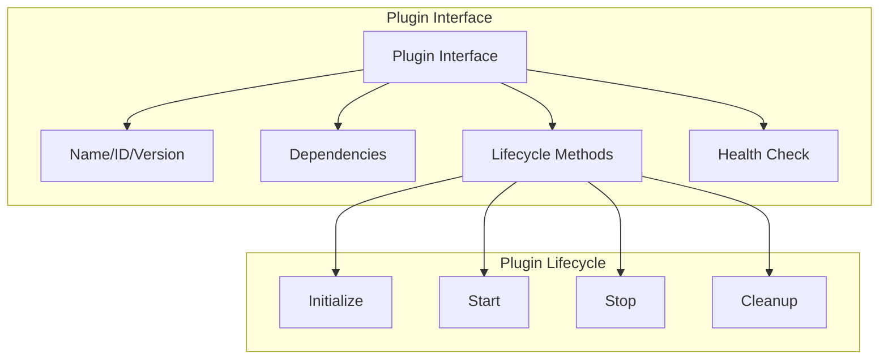

# Lynx Framework Architecture

See also: [Core Refocus Plan](./core_refocus_plan.md)
See also: [Structure Classification And Execution Plan](./structure_classification_plan.md)

## Overview

Lynx should be understood first as a plugin orchestration framework for Go.
It provides a unified runtime, plugin management, and event plumbing for
plugin-based applications.

Lynx core is not intended to duplicate rollout capabilities that already belong
to external platforms such as Kubernetes. In particular, in-process hot reload,
live replacement, and rollout choreography are not strategic core goals.

The codebase currently has three practical layers:

- Core: plugin orchestration, lifecycle, dependency ordering, runtime ownership
- Optional shell: application bootstrap, signal handling, control-plane helpers
- Compatibility surface: singleton access, global event fallbacks, legacy upgrade/config semantics

```
┌─────────────────────────────────────────────────────────────────────────────┐
│                    Shell / Application Layer                                 │
│  ┌──────────────┐  ┌──────────────┐  ┌──────────────┐  ┌──────────────┐   │
│  │   LynxApp    │  │    Boot      │  │   Control    │  │  Certificate │   │
│  │   (app.go)   │  │              │  │    Plane     │  │   Provider   │   │
│  └──────────────┘  └──────────────┘  └──────────────┘  └──────────────┘   │
└─────────────────────────────────────────────────────────────────────────────┘
                                    │
                                    ▼
┌─────────────────────────────────────────────────────────────────────────────┐
│                      Plugin Management Layer                                 │
│  ┌──────────────┐  ┌──────────────┐  ┌──────────────┐  ┌──────────────┐   │
│  │   Manager    │  │  Lifecycle   │  │   Topology   │  │    Ops       │   │
│  │ (manager.go) │  │              │  │              │  │              │   │
│  └──────────────┘  └──────────────┘  └──────────────┘  └──────────────┘   │
└─────────────────────────────────────────────────────────────────────────────┘
                                    │
                                    ▼
┌─────────────────────────────────────────────────────────────────────────────┐
│                           Runtime Layer                                      │
│  ┌──────────────┐  ┌──────────────┐  ┌──────────────┐  ┌──────────────┐   │
│  │ UnifiedRuntime│ │   Events     │  │   Config     │  │   Recovery   │   │
│  │ (plugins/)    │ │   System     │  │              │  │              │   │
│  └──────────────┘  └──────────────┘  └──────────────┘  └──────────────┘   │
└─────────────────────────────────────────────────────────────────────────────┘
                                    │
                                    ▼
┌─────────────────────────────────────────────────────────────────────────────┐
│                         Plugin Ecosystem                                     │
│  ┌────────────────────────────────────────────────────────────────────────┐ │
│  │                        Service Plugins                                  │ │
│  │   lynx-http  │  lynx-grpc  │  lynx-swagger                             │ │
│  └────────────────────────────────────────────────────────────────────────┘ │
│  ┌────────────────────────────────────────────────────────────────────────┐ │
│  │                       Database Plugins                                  │ │
│  │   lynx-mysql  │  lynx-pgsql  │  lynx-mongodb  │  lynx-mssql            │ │
│  └────────────────────────────────────────────────────────────────────────┘ │
│  ┌────────────────────────────────────────────────────────────────────────┐ │
│  │                         Cache Plugins                                   │ │
│  │   lynx-redis  │  lynx-redis-lock  │  lynx-elasticsearch                │ │
│  └────────────────────────────────────────────────────────────────────────┘ │
│  ┌────────────────────────────────────────────────────────────────────────┐ │
│  │                      Message Queue Plugins                              │ │
│  │   lynx-kafka  │  lynx-pulsar  │  lynx-rabbitmq  │  lynx-rocketmq       │ │
│  └────────────────────────────────────────────────────────────────────────┘ │
│  ┌────────────────────────────────────────────────────────────────────────┐ │
│  │                   Service Governance Plugins                            │ │
│  │   lynx-polaris  │  lynx-nacos  │  lynx-apollo  │  lynx-sentinel        │ │
│  └────────────────────────────────────────────────────────────────────────┘ │
│  ┌────────────────────────────────────────────────────────────────────────┐ │
│  │                     Observability Plugins                               │ │
│  │   lynx-tracer  │  (metrics built-in)                                   │ │
│  └────────────────────────────────────────────────────────────────────────┘ │
│  ┌────────────────────────────────────────────────────────────────────────┐ │
│  │                  Distributed Transaction Plugins                        │ │
│  │   lynx-dtm  │  lynx-seata                                              │ │
│  └────────────────────────────────────────────────────────────────────────┘ │
│  ┌────────────────────────────────────────────────────────────────────────┐ │
│  │                         Utility Plugins                                 │ │
│  │   lynx-eon-id  │  lynx-openim  │  lynx-sql-sdk                         │ │
│  └────────────────────────────────────────────────────────────────────────┘ │
└─────────────────────────────────────────────────────────────────────────────┘
```

## Core Package Structure

### Root Package (`github.com/go-lynx/lynx`)

The root package contains the orchestration core plus some application-facing
assembly code:

| File | Description |
|------|-------------|
| `doc.go` | Package documentation |
| `app.go` | App instance assembly, singleton compatibility, runtime wiring, and shutdown |
| `manager.go` | Plugin manager interfaces and DefaultPluginManager implementation |
| `lifecycle.go` | Plugin lifecycle operations (init/start/stop with safety) |
| `ops.go` | Plugin loading/unloading operations and resource management |
| `topology.go` | Plugin dependency resolution and topological sorting |
| `prepare.go` | Configuration-driven plugin preparation |
| `runtime.go` | Backward-compatible runtime wrapper delegating to `plugins.UnifiedRuntime` |
| `controlplane.go` | Optional shell-facing control plane composition interfaces |
| `certificate.go` | CertificateProvider interface for TLS |
| `recovery.go` | Error recovery and circuit breaker mechanisms |

### Sub-packages

| Package | Description |
|---------|-------------|
| `boot/` | Optional application bootstrap shell and process lifecycle glue |
| `cmd/` | CLI entrypoints (e.g., `lynx` tool) |
| `conf/` | Configuration proto definitions |
| `events/` | Event system plus compatibility global access helpers |
| `log/` | Logging system with zerolog integration |
| `tls/` | TLS certificate management and validation |
| `cache/` | Caching abstractions and implementations |
| `subscribe/` | Service subscription and dependency management |
| `observability/` | Metrics and monitoring utilities |
| `pkg/` | Reusable utility packages (auth, cast, collection, etc.) |
| `internal/` | Private implementation details |
| `plugins/` | Plugin SDK and `UnifiedRuntime` implementation |

## Plugin System Architecture

### Plugin Interface Hierarchy


```mermaid
graph TB
    subgraph "Plugin Interface"
        A[Plugin Interface]
        B[Name/ID/Version]
        C[Dependencies]
        D[Lifecycle Methods]
        E[Health Check]
    end
    
    subgraph "Plugin Lifecycle"
        F[Initialize]
        G[Start]
        H[Stop]
        I[Cleanup]
    end
    
    A --> B
    A --> C
    A --> D
    A --> E
    D --> F
    D --> G
    D --> H
    D --> I
```

### Plugin Manager

The `DefaultPluginManager` is the real heart of the framework. It handles:

- Plugin registration and lookup
- Dependency-aware plugin loading (topological sort)
- Parallel plugin startup with failure cleanup on startup error
- Graceful plugin shutdown in reverse order
- Resource cleanup and statistics

### Plugin Lifecycle

```
┌─────────┐    ┌────────────┐    ┌─────────┐    ┌─────────┐
│  Load   │ -> │ Initialize │ -> │  Start  │ -> │ Running │
└─────────┘    └────────────┘    └─────────┘    └─────────┘
                                                     │
                                                     ▼
                                              ┌─────────┐
                                              │  Stop   │
                                              └─────────┘
                                                     │
                                                     ▼
                                              ┌─────────┐
                                              │ Cleanup │
                                              └─────────┘
```

## Event System

### Event Types

The framework supports a unified event system for inter-plugin communication:

```go
type PluginEvent struct {
    Type      EventType       // Event type (started, stopped, dependency/error, etc.)
    Priority  EventPriority   // Event priority
    Source    string          // Event source
    Category  string          // Event category
    PluginID  string          // Plugin ID
    Status    PluginStatus    // Plugin status
    Timestamp int64           // Unix timestamp
    Metadata  map[string]any  // Additional metadata
}
```

### Event Bus Manager

- Asynchronous event processing with configurable workers
- Event filtering and history tracking
- Plugin-specific listeners
- Memory-optimized event handling with object pooling

## Runtime System

### UnifiedRuntime

Provides:

- Resource registration and retrieval (shared and private)
- Configuration access
- Event emission and listening
- Plugin context management

The runtime implementation is shared-state based. Plugin-scoped views created by
`WithPluginContext()` are access-control views over the same runtime state,
not stale copies of config/logger/event wiring.

### Resource Management

- **Private Resources**: Isolated per-plugin resources
- **Shared Resources**: Cross-plugin shared resources
- **Resource Info**: Lifecycle tracking and statistics

## Optional Shell Integration

Lynx includes optional shell-facing helpers for:

- Service discovery and registration
- Configuration management (single and multi-config)
- Rate limiting (HTTP and gRPC)
- Circuit breaking
- Load balancing

Examples of supported control-plane plugins:
- **Polaris** (`lynx-polaris`)
- **Nacos** (`lynx-nacos`)
- **Apollo** (`lynx-apollo`)

These integrations should be understood as shell/application conveniences rather
than evidence that Lynx core itself is a general-purpose control plane.

## Plugin Ecosystem

### Service Plugins

| Plugin | Description |
|--------|-------------|
| `lynx-http` | HTTP server with TLS, middleware, metrics |
| `lynx-grpc` | gRPC server/client with connection pooling, retry |
| `lynx-swagger` | OpenAPI documentation generation |

### Database Plugins

| Plugin | Description |
|--------|-------------|
| `lynx-mysql` | MySQL with connection pooling, health monitoring |
| `lynx-pgsql` | PostgreSQL support |
| `lynx-mongodb` | MongoDB integration |
| `lynx-mssql` | Microsoft SQL Server support |
| `lynx-elasticsearch` | Elasticsearch client |

### Cache & NoSQL Plugins

| Plugin | Description |
|--------|-------------|
| `lynx-redis` | Redis UniversalClient (standalone/cluster/sentinel) |
| `lynx-redis-lock` | Distributed locking with Redis |

### Message Queue Plugins

| Plugin | Description |
|--------|-------------|
| `lynx-kafka` | Kafka producer/consumer with batching |
| `lynx-pulsar` | Apache Pulsar integration |
| `lynx-rabbitmq` | RabbitMQ with connection pooling |
| `lynx-rocketmq` | Apache RocketMQ support |

### Service Governance Plugins

| Plugin | Description |
|--------|-------------|
| `lynx-polaris` | Tencent Polaris service mesh |
| `lynx-nacos` | Alibaba Nacos service discovery |
| `lynx-apollo` | Apollo configuration center |
| `lynx-sentinel` | Alibaba Sentinel flow control |

### Observability Plugins

| Plugin | Description |
|--------|-------------|
| `lynx-tracer` | OpenTelemetry distributed tracing |

### Distributed Transaction Plugins

| Plugin | Description |
|--------|-------------|
| `lynx-dtm` | DTM distributed transaction manager |
| `lynx-seata` | Alibaba Seata transaction coordinator |

### Utility Plugins

| Plugin | Description |
|--------|-------------|
| `lynx-eon-id` | Distributed ID generator |
| `lynx-openim` | OpenIM instant messaging |
| `lynx-sql-sdk` | SQL toolkit and utilities |

## Configuration System

### Configuration Sources

- Local YAML/JSON files
- Remote configuration centers (Polaris, Nacos, Apollo)
- Environment variables
- Command-line arguments

### Multi-Configuration Support

```yaml
lynx:
  polaris:
    service_config:
      group: DEFAULT_GROUP
      filename: application.yaml
      additional_configs:
        - group: SHARED_GROUP
          filename: shared-config.yaml
          priority: 10
        - group: ENV_GROUP
          filename: env-specific.yaml
          priority: 20
          merge_strategy: override
```

## Usage Example

```go
package main

import (
    "github.com/go-lynx/lynx"
    "github.com/go-lynx/lynx/boot"
)

func main() {
    // Create and start application
    app := boot.NewApplication(func(cfg config.Config) (*kratos.App, error) {
        // Initialize your services here
        return kratos.New(
            kratos.Name(lynx.GetName()),
            kratos.Version(lynx.GetVersion()),
        ), nil
    })
    
    if err := app.Run(); err != nil {
        log.Fatal(err)
    }
}
```

## Design Principles

1. **Plugin-First**: Everything is a plugin, enabling modular and extensible architecture
2. **Dependency-Aware**: Automatic dependency resolution and ordered startup/shutdown
3. **Event-Driven**: Loosely coupled inter-plugin communication
4. **Production-Ready**: Built-in health checks, metrics, and graceful shutdown
5. **Cloud-Native**: Designed for Kubernetes and microservice architectures
6. **Type-Safe**: Generic support for type-safe resource access

## Best Practices

### Plugin Development

1. Implement the `Plugin` interface completely
2. Declare dependencies accurately
3. Handle initialization failures gracefully
4. Implement proper cleanup in Stop/Cleanup methods
5. Emit events for significant state changes

### Configuration Management

1. Use environment-specific configurations
2. Leverage remote configuration centers for dynamic updates
3. Validate configurations before plugin startup
4. Use secure practices for sensitive data

### Monitoring

1. Export Prometheus metrics
2. Implement health checks
3. Use distributed tracing
4. Monitor resource usage and connection pools

## Summary

Lynx provides a powerful, flexible, and type-safe plugin system architecture. Through layered design, unified event system, comprehensive plugin ecosystem, and production-ready features, it offers a solid foundation for building cloud-native microservices in Go.
